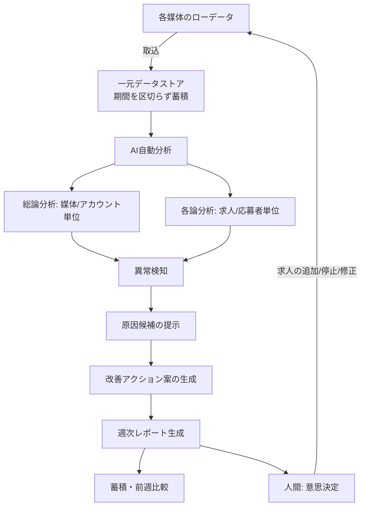
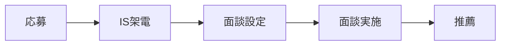

# 03. To-Be 業務フロー

## 全体サイクル（フェーズ1のスコープ）



放置していても、毎週この一連の処理が回ってレポートが生成される状態を目指す（人が都度Claude/ChatGPTにファイルを投げる運用を廃止）。

## 週次レポートに最低限含める項目

- 全体応募数 / 有効応募数
- 35歳以下率 / 35歳以上率 / 外国籍率
- CPA / 有効応募CPA
- 媒体別 / アカウント別 / 職種別 / 地域別の内訳
- ワースト求人 / ベスト求人
- 前週比
- 次週アクション（AIが叩き台を出す）

## 分析の2系統

### A. 総論：キャンペーン／媒体／アカウント単位

応募数・クリック率・CPA・有効応募率・35歳以下応募率・地域別応募構成・アカウント別成果・職種大分類別成果を見る。
CPAは単体の高低で判断せず、35歳以下の有効応募が取れているかとセットで評価する（[05 KPI定義](05_kpi_definitions.md) 参照）。

### B. 各論：応募者／求人単位

求人ごとに35歳以上比率・外国籍比率・35歳以下比率・有効応募率・地域・職種・求人別CPAを見て、「シニアが異常に多い求人」「外国籍応募が偏る求人」などを自動検知する。

### 掘り下げの軸

```
媒体 → アカウント → 求人 → 応募者属性
```

まで掘り、「どこから35歳以下の応募が来ているのか」を特定する。勤務地は特に一都三県／大阪／名古屋／福岡を重視する。

媒体によってはさらにキーワード単位まで掘り下げる（求人ボックスで確認済み。[10 求人ボックスキーワード分析](10_kyujinbox_keyword_analysis.md) 参照）。

```
検索語句 → 求人ごとのクリック・応募 → 35歳以下の有効応募 → 面談設定 → 獲得単価（CPA）
```

この順で見ることで、「応募数は多いが質が低い検索語句」と「応募数は少ないが面談につながる求人」を切り分けられる。掲載順位は入札額だけでなく検索語句との関連性・求人品質にも左右されるため、入札を上げる前に原稿とターゲットのずれを直す余地がある。

## 改善アクション提案の例

分析結果から、以下のような具体的なアクション案までAIが出す。人間は意思決定（採用/却下/修正）に専念する。

- 「接客販売求人をあと○本追加」（特定職種の若年層応募が不足している場合）
- 「このアカウントに○求人追加」（成果の良いアカウントへの積み増し）
- 「CPA○円以内を目標」
- 「この求人は35歳以上比率が高いので停止／修正」

## 人材紹介事業のファネル可視化（週次/月次で並走）



日次稼働・推薦数・面談設定数・面談実施数を必須項目としてHubSpot等から拾う。中間工程（架電数など）は後回しでよい。

## フェーズ2（本要件定義の対象外）との接続点

週次/月次で蓄積された振り返りデータが、フェーズ2で設計する「月次戦略計画」の主要インプットになる想定。フェーズ1では、この接続を見据えて振り返りデータを後から機械的に参照しやすい形（[04 データモデル](04_data_model.md)）で残すことだけを意識し、計画側のロジックは作り込まない。
