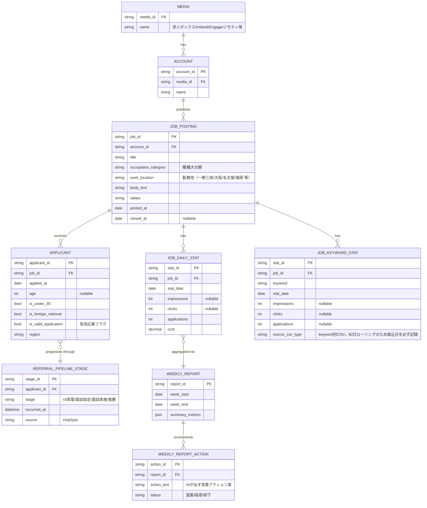

# 04. データモデル（ドラフト）

具体的なテーブル定義・型は、[09 未決事項](09_open_questions.md) のデータ蓄積先（Q-01）が決まってから確定する。ここでは中心概念（エンティティ）と関係のみ定義する。

## ER図（概念レベル）

## 設計上の論点（未決）

- **求人の版管理**: 同一求人が期間中にタイトル・本文・給与を変更した場合、変更前後を別バージョンとして残すか（dr-system の Target/Search/Copy の Version 概念に相当）。特徴量分析（「20代活躍中」表記の効果検証など）の精度に直結するため要検討 → [09 Q-08](09_open_questions.md)
- **応募者の個人情報**: dr-system は候補者の個人情報（氏名・電話・メール・経歴）を持たない方針（D-11相当）。本システムも年齢・国籍・地域・有効応募フラグ等の**属性のみ**を蓄積し、個人を特定する情報は持たない想定 → 要確認 [09 Q-09](09_open_questions.md)
- **有効応募の定義**: 「有効応募」が何を指すか（応募後に一次選考へ進んだもの、重複・スパムを除いたもの等）を明確に定義する必要がある → [09 Q-05](09_open_questions.md)
- **物理削除しない方針**: dr-system 同様、マスタ・実績は物理削除せず無効化のみとする想定（監査性のため）
